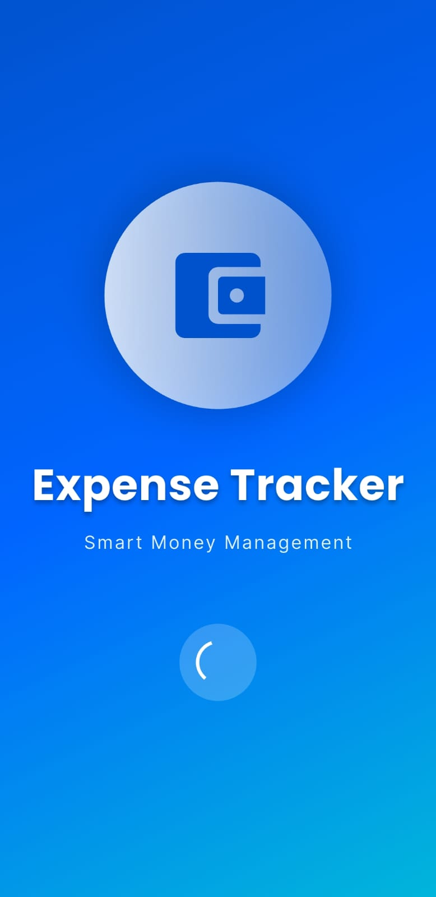
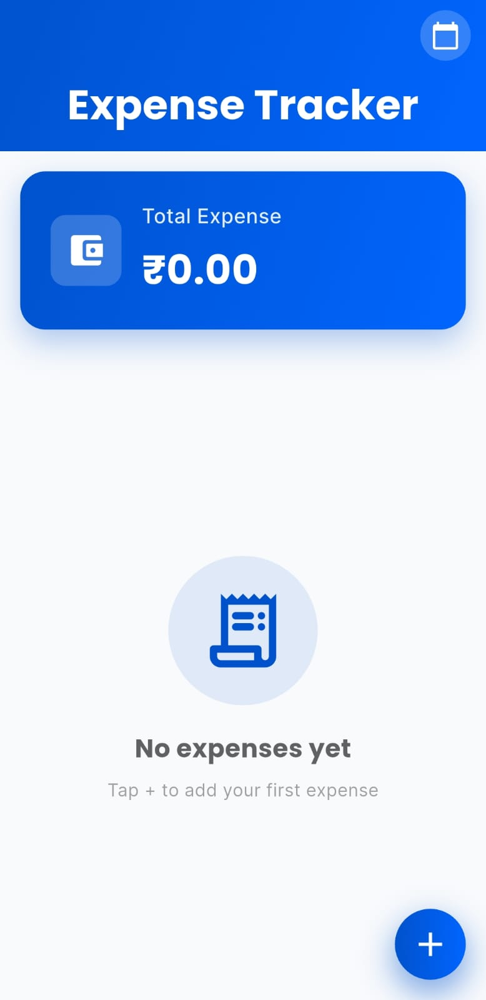
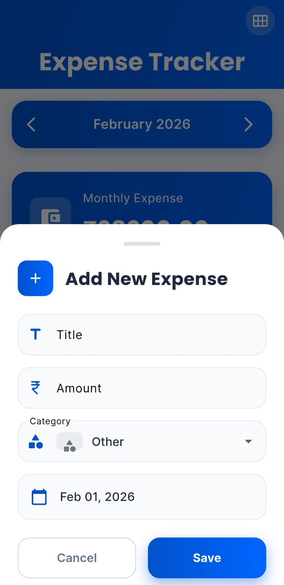
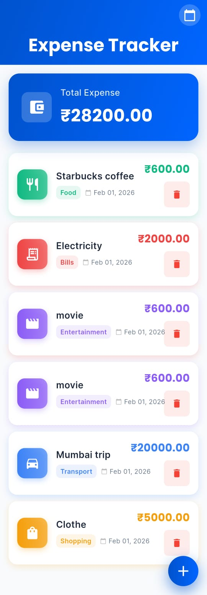

# Expense Tracker App 💰

A feature-rich expense tracking mobile application developed as part of my mobile application development coursework. This project demonstrates proficiency in Flutter development, Firebase integration, and modern mobile UI/UX design principles.


## 📖 About The Project

This expense tracker application helps users manage their personal finances by recording and categorizing daily expenses. Built with Flutter and Firebase, the app provides a seamless cross-platform experience with real-time data synchronization.

### Key Features

- ✅ Add, view, and manage expenses effortlessly
- ✅ Categorize expenses (Food, Transport, Shopping, Bills, Entertainment, etc.)
- ✅ Month-wise expense tracking and navigation
- ✅ Real-time cloud synchronization using Firebase Firestore
- ✅ Clean and intuitive user interface with Google Fonts
- ✅ Splash screen for enhanced user experience
- ✅ Responsive design for multiple screen sizes

## 🛠️ Built With

This project utilizes the following technologies and packages:

- **[Flutter](https://flutter.dev/)** - Cross-platform UI framework
- **[Firebase Core](https://firebase.google.com/)** (v4.4.0) - Firebase initialization
- **[Cloud Firestore](https://pub.dev/packages/cloud_firestore)** (v6.1.2) - NoSQL cloud database
- **[Google Fonts](https://pub.dev/packages/google_fonts)** (v6.1.0) - Custom typography
- **[Intl](https://pub.dev/packages/intl)** (v0.20.2) - Date formatting and localization

## 📱 Screenshots

<div align="center">
  
  
  
  
</div>

<div align="center">
  <p><em>Splash Screen • Home Screen • Add Expense • Insert Data</em></p>
</div>

## 🚀 Getting Started

Follow these instructions to set up and run the project locally.

### Prerequisites

Ensure you have the following installed on your system:

- Flutter SDK (version 3.10.7 or higher)
- Dart SDK
- Android Studio or VS Code with Flutter extensions
- Git
- A Firebase account

### Installation

1. **Clone the repository**
   ```bash
   git clone https://github.com/yourusername/flutter_application_1.git
   cd flutter_application_1
   ```

2. **Install dependencies**
   ```bash
   flutter pub get
   ```

3. **Firebase Configuration**
   
   - Create a new project in [Firebase Console](https://console.firebase.google.com/)
   - Enable Cloud Firestore in your Firebase project
   - Add your platform-specific configuration files:
     - **Android**: Download `google-services.json` and place it in `android/app/`
     - **iOS**: Download `GoogleService-Info.plist` and place it in `ios/Runner/`
   - Run FlutterFire CLI to configure (optional):
     ```bash
     flutterfire configure
     ```

4. **Run the application**
   ```bash
   flutter run
   ```

## 📂 Project Structure

```
lib/
├── main.dart                   # Application entry point
├── firebase_options.dart       # Firebase configuration
├── models/
│   └── expense.dart           # Expense model class
├── screens/
│   ├── SplaceScreen.dart      # Initial splash screen
│   ├── add_expense.dart       # Add/Edit expense screen
│   └── expense_card.dart      # Expense display widget
└── services/
    └── firestore_services.dart # Firebase database operations
```

## 💡 How It Works

1. **Adding Expenses**: Users can tap the add button to create a new expense entry with amount, category, date, and description
2. **Viewing Expenses**: All expenses are displayed in a card-based layout, organized by date
3. **Monthly Navigation**: Users can navigate between different months to view historical expenses
4. **Cloud Sync**: All data is automatically synchronized with Firebase Firestore for access across devices

## 🎓 Learning Outcomes

Through this project, I gained hands-on experience with:

- Building cross-platform mobile applications using Flutter
- Implementing Firebase authentication and database services
- State management in Flutter applications
- Creating responsive and visually appealing UI designs
- Working with third-party packages and APIs
- Version control using Git and GitHub
- Software development best practices

## 🔮 Future Enhancements

- [ ] Add expense editing and deletion functionality
- [ ] Implement monthly/yearly expense statistics and charts
- [ ] Add budget setting and notifications
- [ ] Include expense filtering and search features
- [ ] Add export functionality (PDF/CSV)
- [ ] Implement user authentication
- [ ] Support multiple currencies
- [ ] Add dark mode theme

## 🤝 Contributing

This is an academic project, but suggestions and feedback are always welcome! Feel free to:

1. Fork the project
2. Create your feature branch (`git checkout -b feature/NewFeature`)
3. Commit your changes (`git commit -m 'Add some NewFeature'`)
4. Push to the branch (`git push origin feature/NewFeature`)
5. Open a Pull Request

## 📝 License

This project is open source and available for educational purposes.

## 👨‍💻 Author

**Your Name**
- GitHub: [@yourusername](https://github.com/yourusername)
- LinkedIn: [Your LinkedIn](https://linkedin.com/in/yourprofile)
- Email: your.email@example.com

## 🙏 Acknowledgments

- My instructor and peers for guidance and feedback
- Flutter and Firebase documentation
- The Flutter community for excellent resources and support
- [Flutter.dev](https://flutter.dev/) tutorials and codelabs

---

⭐ If you found this project interesting, please consider giving it a star!

**Note**: This project was developed as part of my academic coursework in Mobile Application Development.
